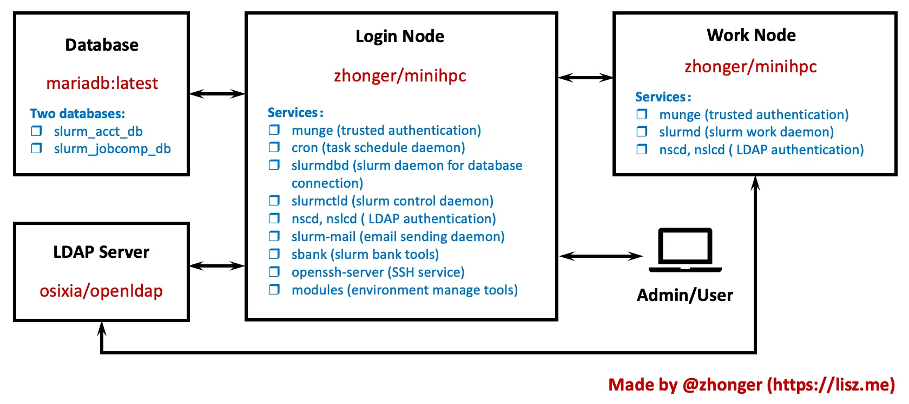

A simple way to deploy and manage slurm cluster.


[](https://github.com/zhonger/MiniHPC/blob/main/LICENSE)
[](https://app.fossa.com/projects/git%2Bgithub.com%2Fzhonger%2FMiniHPC?ref=badge_shield&issueType=license)

## Requirements


[](https://github.com/neilmunday/slurm-mail)
[](https://github.com/zhonger/slurm-bank)
-blue)

## Architecture

Here is the architecture of MiniHPC as the following figure shows.

We include all requirements in the [zhonger/minihpc](https://hub.docker.com/r/zhonger/minihpc) docker image and other images provided by the community.



Defaultly, the container as login node cannot be work node at the same time.

If you want them in the same physical node, two containers with different configurations will be necessary.

Then one container is login node and another one is work node.

## Quick start

### Preparing networks

MiniHPC can be used in single node or multiple nodes. It will be no additional physical requirements for networks.

If in multiple nodes or the cluster, please confirm that all nodes can be directly connected with routers or switches.

For example, the nodes can be accessed each other if they are set as the same local network, such as `192.168.121.0/24`.

#### Example for networks

If we have a single node or more, then two local networks can be used:

- `192.168.120.0/24` for internal network (macvlan)
- `192.168.121.0/24` for external network (bridge)

And `sake` is login node. `db` is database. `slapd` is LDAP. `w1` and `w2`are work nodes.

| Container | IP | Purpose |
| --: | :-- | :-- |
| db | 192.168.121.101 | MariaDB |
| sake | 192.168.121.100 | Outside access and access database |
| sake | 192.168.120.100 | Connect other slurm nodes |
| slapd | 192.168.120.99 | OpenLDAP |
| w1 | 192.168.120.101 | work node 1 |
| w2 | 192.168.120.102 | work node 2 |

### Preparing directories

The usage of MiniHPC requires a **sharing filesystem** if used for multiple nodes (or the cluster), such as NFS or others.

First of all, please create home directory in the sharing filesystem. Any name for home directory is ok.

And then create directories using the following commands:

```bash
mkdir data && cd data
mkdir db ldap slurm slurm-mail logs root users share share/db_init && cd ../
mkdir work && cd work
mkdir w1 w2 ... # create one directory for each node
```

| Directory | Purpose |
| :-- | :-- |
| data/db | data files for mariadb |
| data/ldap | data files for LDAP |
| data/slurm | data files for slurm daemons |
| data/slurm-mail | data files for slurm mail|
| data/logs | log files for slurm and slurm mail |
| data/root | the home directory for root user|
| data/users | the home directories for slurm users |
| data/share | sharing configurations |
| work/w1 | the `docker-compose.yml` file |

### Preparing configurations

The most important thing is to prepare the necessary configuration files for your environments as follows.

| Source Path | Target Path | Purpose |
| :-- | :-- | :-- |
| conf/db_init/01.sql | data/share/db_init/01.sql | the initial sql for mariadb (no need to change) |
| conf/slurm.conf | data/share/slurm.conf | slurmctld (login node) and slurmd (work node) |
| conf/slurmdb.conf | data/share/slurmdb.conf | slurmdb (login node) |
| conf/slurm-mail.conf | data/share/slurm-mail.conf | slurm-mail (login node) |
| conf/nslcd.conf | data/share/nslcd.conf | LDAP connection for control |
| scripts/getPublicKey | data/share/getPublicKey | LDAP connection for readyonly |
| data/share/hosts | data/share/hosts | hostname mapping |

Copy them from source code to created directories and change to your own settings.

Optional configuration files are as follows:

| Source Path | Target Path | Purpose |
| :-- | :-- | :-- |
| conf/80-minihpc-news | data/share/80-minihpc-news | welcome message at login |
| conf/sshd_config | data/share/sshd_config | SSH config |

### Create MiniHPC

Copy the necessary sections in `docker-compose.yml` and change to your own settings.

#### Example for MiniHPC

If you have two nodes, one is for login and work and another one is only for work.

- **For login and work node**: `db`, `sake`, `slapd` and `w1`.

- **For only work node**: `w2`.

**Please be careful about the relative path in the volume section of `docker-compose.yml`.**

### Manage accounts

The users and SSH public keys are managed by LDAP services, so additional LDPA manage softwares such as [LDAPAccountManager/lam](https://www.ldap-account-manager.org/lamcms/), [leenooks/phpLDAPadmin](https://github.com/leenooks/phpLDAPadmin) can be used to connect LDAP service and manage accounts in MiniHPC.

The project and resource limits is enabled in default. It can be managed by `sbank` command when accessing the login node with `root` user. Please use `sbank -h` for more details.

In future, a web UI will be provided for managing MiniHPC conveniently.

## TODO

### Web UI

- [ ] create accounts
- [ ] manage SSH public keys
- [ ] change password
- [ ] create project and resources
- [ ] monitoring
- [ ] resource usage statistics

### Features

- [ ] GPU support
- [ ] LDAP docker image

## Thanks

Thanks to [@neilmunday](https://github.com/neilmunday) and [@jcftang](https://github.com/jcftang) providing good tools ([slurm-mail](https://github.com/neilmunday/slurm-mail) and [slurm-bank](https://github.com/jcftang/slurm-bank)) for enhancing the experience of Slurm.

Thanks to the [Mariadb Community](https://github.com/MariaDB) and [@osxia](https://github.com/osixia) providing good dockerlized images ([mariadb](https://github.com/MariaDB/mariadb-docker) and [openldap](https://github.com/osixia/docker-openldap)) for convienent usage.

## License

MiniHPC is released under [MIT](https://github.com/zhonger/MiniHPC/blob/main/LICENSE) license.

[](https://app.fossa.com/projects/git%2Bgithub.com%2Fzhonger%2FMiniHPC?ref=badge_large&issueType=license)


